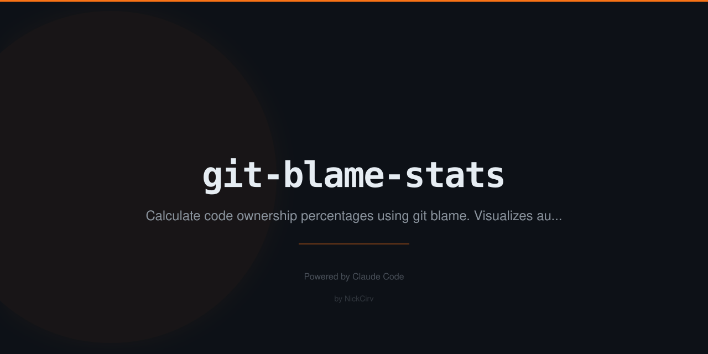

# git-blame-stats

Zero-dependency CLI tool that analyzes `git blame` to show code ownership — who wrote what percentage of your codebase, by author, file, directory, and language.

## Install

```bash
npm install -g git-blame-stats
```

Or run directly with npx:

```bash
npx git-blame-stats
```

## Usage

```
git-blame-stats                      Full ownership report for current repo
git-blame-stats <file>               Blame stats for a specific file
git-blame-stats leaderboard          Ranked author table with first/last commit dates
git-blame-stats --dir <path>         Stats for a directory
git-blame-stats --lang <ext>         Filter by file extension (js, ts, py, ...)
git-blame-stats --author <name>      Per-file breakdown for one author
git-blame-stats --top <N>            Top N files by most authors (high churn indicator)
git-blame-stats --since <date>       Limit analysis to recent blame
git-blame-stats --format json        Machine-readable JSON output
```

Short alias: `gbs`

## Examples

```bash
# Full ownership report
git-blame-stats

# Who owns a specific file?
git-blame-stats src/index.js

# TypeScript files only, last 3 months
git-blame-stats --lang ts --since "3 months ago"

# Alice's contributions, file by file
git-blame-stats --author "Alice"

# Top 5 most-contested files (churn indicators)
git-blame-stats --top 5

# Full leaderboard with commit history
git-blame-stats leaderboard

# JSON output for CI pipelines or tooling
git-blame-stats --format json > ownership.json

# Specific directory only
git-blame-stats --dir src/components
```

## Output

### Default (ownership report)

```
  Code Ownership Report
  ──────────────────────────────────────────────────────────────────────
  Author                    Lines  Files   Share  Bar
  ──────────────────────────────────────────────────────────────────────
  Alice Smith                4821     23   48.2%  ████████████████░░░░░░░░░░░░░░
  Bob Jones                  2910     15   29.1%  ████████████░░░░░░░░░░░░░░░░░░
  Carol White                1453      9   14.5%  ██████░░░░░░░░░░░░░░░░░░░░░░░░
  (4 others)                  818              8.2%  ███░░░░░░░░░░░░░░░░░░░░░░░░░░░
  ──────────────────────────────────────────────────────────────────────
  Total                     10002
```

### Leaderboard

```
  Leaderboard
  ────────────────────────────────────────────────────────────────────────────────
  #    Author                     Lines  Files   Share   First       Last
  ────────────────────────────────────────────────────────────────────────────────
  1    Alice Smith                 4821     23   48.2%  2023-01-15  2026-02-28
  2    Bob Jones                   2910     15   29.1%  2023-03-20  2026-01-10
```

## Features

- **Zero npm dependencies** — uses only Node.js built-ins (`child_process`, `fs`, `path`)
- **Binary file detection** — skips non-text files automatically
- **Large file protection** — skips files over 10MB
- **Batch parallel processing** — analyzes 10 files at a time with progress indicator
- **Colored output** — top 5 authors highlighted in distinct colors (respects `NO_COLOR`)
- **JSON mode** — pipe into other tools or CI pipelines
- **Language filtering** — focus on just `.ts`, `.py`, `.go`, etc.
- **Churn detection** — find files touched by the most authors (high contention)
- **Author spotlight** — see exactly which files one person owns and by how much

## Requirements

- Node.js 18+
- Git installed and available in PATH
- Must be run inside a git repository

## Security

- No credentials, tokens, or secrets are read or written
- All git operations are read-only
- Uses `execFileSync`/`spawnSync` with explicit argument arrays — no shell injection

## License

MIT
